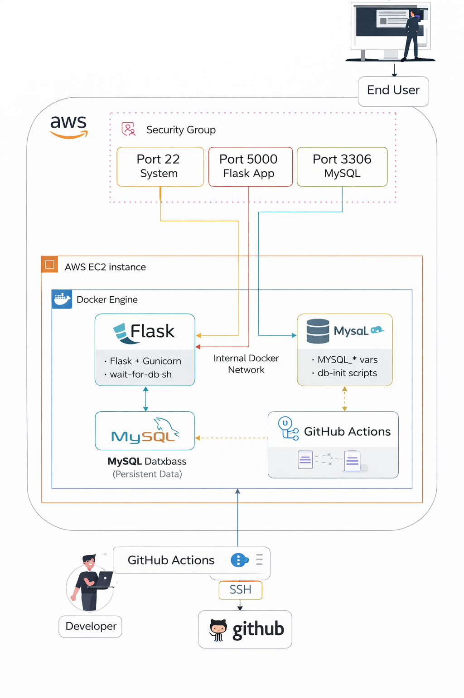
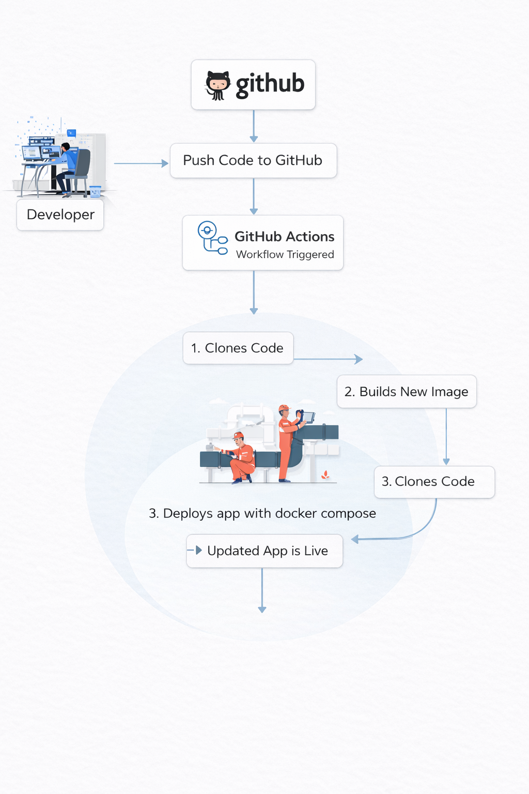
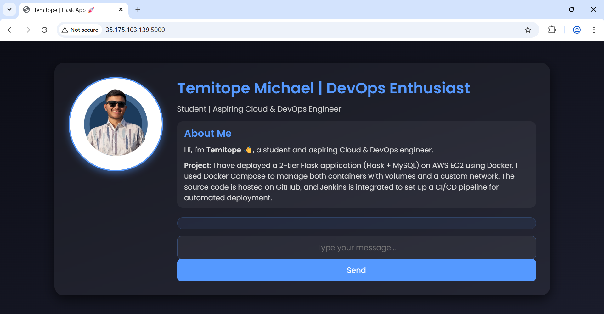
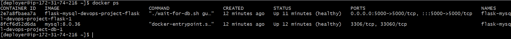
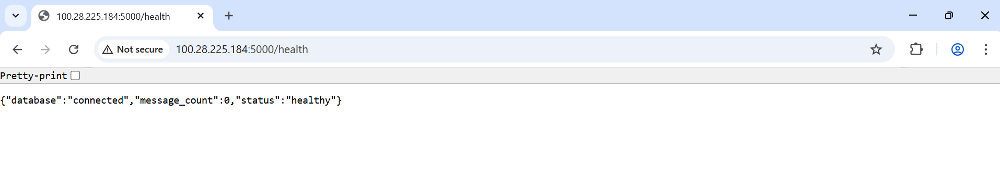
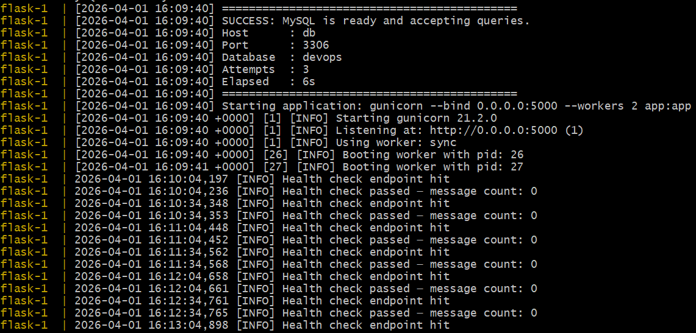
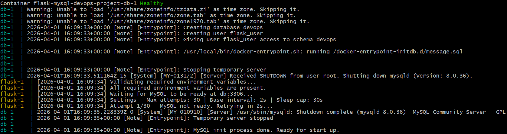
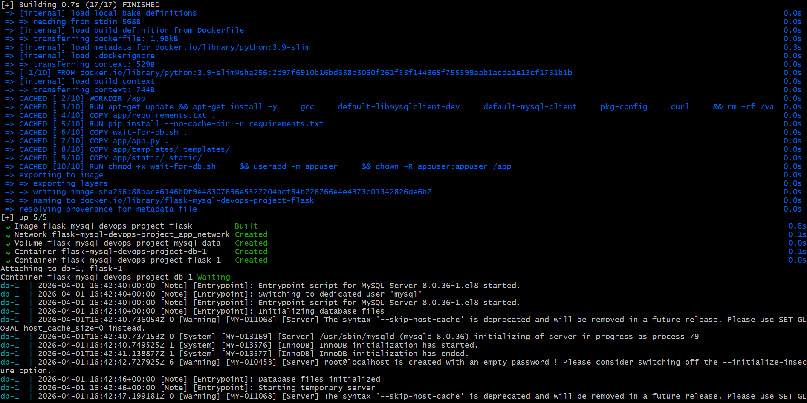
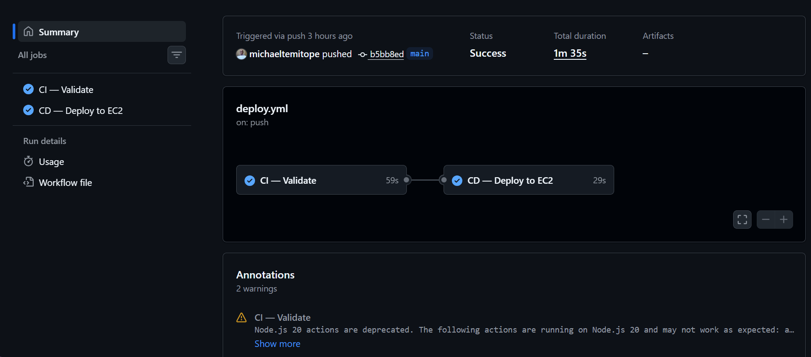

# 🚀 Two-Tier Flask + MySQL Application (Docker + CI/CD)

> A production-style DevOps project demonstrating Dockerized application deployment with CI/CD automation on AWS EC2.

A two-tier web application built with **Flask and MySQL**, containerized using **Docker Compose**, and deployed to **AWS EC2** via a **GitHub Actions CI/CD pipeline**.

This project focuses on applying real-world **DevOps practices**, including container orchestration, service dependency management, automated deployment, and environment configuration.

---

## 🏗️ Architecture Overview

### 📌 Infrastructure Design


### 🔄 CI/CD Workflow


### 🧠 Summary
- Flask and MySQL run in **separate containers**
- Communication happens via an **internal Docker network**
- MySQL data is stored in a **persistent Docker volume**
- Deployment is handled via **GitHub Actions → EC2 (SSH)**

---

## 🧱 Tech Stack

- **Backend:** Flask (Python)
- **Database:** MySQL
- **Containerization:** Docker, Docker Compose
- **Process Manager:** Gunicorn
- **CI/CD:** GitHub Actions
- **Cloud:** AWS EC2
- **Scripting:** Bash (wait-for-db.sh)

---

## ⚙️ Key Features

- 🔄 Automated deployment on push to `main`
- 🧪 Integration testing in CI (Flask + MySQL)
- ⏳ Database readiness handling via `wait-for-db.sh`
- 🔐 Secure environment variable handling (`.env`)
- 🗄️ Database initialization using SQL scripts
- 📦 Persistent storage using Docker volumes
- ❤️ Health check endpoint for monitoring

---

## 📂 Project Structure

```text
.
├── app/
├── db-init/
│   └── message.sql
├── diagrams/
│   ├── infrastructure.png
│   └── project-workflow.png
├── screenshots/
│   ├── 1-app-homepage.png
│   ├── 2-docker-ps.png
│   ├── 3-health-endpoint.png
│   ├── 4-wait-for-db.png
│   ├── docker-compose-logs.png
│   ├── db-query.png
│   └── project-structure.png
├── wait-for-db.sh
├── docker-compose.yml
├── Dockerfile
├── .env
├── .env.example
├── .dockerignore
└── .github/workflows/ci-cd.yml

```

## 🚀 Getting Started (Local Setup)

1. Clone repository
git clone https://github.com/michaeltemitope/Flask-MySQL-DevOps-Project.git
cd Flask-MySQL-DevOps-Project

2. Create .env file
DB_HOST=db
DB_PORT=3306
DB_USER=flask_user
DB_PASSWORD=flask_password
DB_NAME=devops

MYSQL_ROOT_PASSWORD=root
MYSQL_USER=flask_user
MYSQL_PASSWORD=flask_password
MYSQL_DATABASE=devops

3. Run the application
docker compose up --build

4. Access the app
http://localhost:5000

## 📸 Application Screenshots

### 🏠 Homepage


### 🐳 Running Containers


### ❤️ Health Endpoint


### ⏳ Database Readiness (wait-for-db.sh)


### 🗄️ Database Verification

Shows data created from db-init/message.sql

### 📦 Docker Compose Logs (Startup Flow)


### 🧱 Project Structure

## 🔄 CI/CD Pipeline


Workflow Overview
- Developer pushes code to main
- GitHub Actions runs CI:
    - validate Docker Compose
    - build Docker image
    - run integration tests
- If CI passes:
    - SSH into EC2
    - pull latest code
    - rebuild and restart containers
- Verify deployment via /health endpoint

## 🔧 Deployment Model
- CI runs on GitHub-hosted runners
- CD deploys via SSH to EC2
- Docker images are built on EC2
- No external container registry used (intentional design choice)

## ☁️ Deployment (AWS EC2)

- EC2 instance runs:
    - Docker
    - Docker Compose
- Only exposed ports:
    - 5000 → Flask app
    - 22 → SSH
MySQL is not publicly exposed

## 🧠 Design Decisions

- Why wait-for-db.sh?

Ensures Flask starts only after MySQL is ready, preventing connection errors during startup.

- Why separate DB_* and MYSQL_* variables?
DB_* → used by Flask app
MYSQL_* → used by MySQL container initialization

This separation improves clarity and avoids configuration conflicts.

- Why no Docker registry (ECR/Docker Hub)?
This project uses a build-on-server (EC2) deployment model.

A registry-based workflow will be implemented in a future Kubernetes-based project.

## ⚠️ Limitations

- Brief downtime during deployment
- No rollback mechanism yet
- No image versioning (images built on EC2)
- Single EC2 instance (no high availability)

These are intentional trade-offs for simplicity and learning purposes.

## 📚 What I Learned

- Docker container orchestration with Compose
- Handling service dependencies in distributed systems
- Secure environment variable management
- CI/CD pipeline design using GitHub Actions
- Debugging real-world deployment issues

## 👨‍💻 Author

🔧 Temitope — DevOps Engineer

Built as part of a portfolio project focused on real-world deployment practices.

## 📄 License

This project is licensed under the MIT License — see the LICENSE
 file for details.